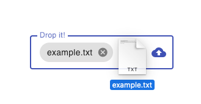

# ngx-dropzone

This library provides a reusable dropzone component infrastructure and Material
Design implementation.

Like the Angular Material repo, it uses a monorepo setup for maximum extensibility.

| Package                  | Description                                      |
| ------------------------ | ------------------------------------------------ |
| `@ngx-dropzone/cdk`      | Common dropzone interaction patterns.            |
| `@ngx-dropzone/material` | Material Design implementation based on the CDK. |

While the CDK itself is basically headless, the Material implementation relies
on the [Angular Material components](https://github.com/angular/components) to
provide a consistent style integration.



## Installation

You may only want to install the dropzone CDK to apply your own styling.

```sh
npm install @ngx-dropzone/cdk
```

For the Material Design implementation, install both packages.

```sh
npm install @ngx-dropzone/cdk @ngx-dropzone/material
```

## Versioning

For the versioning, we stay consistent with the major Angular releases.
So Angular (components) v16 will be compatible with `@ngx-dropzone/cdk@16.x.x`.

Please note, that v16 is the first officially supported version.
For older Angular releases, use the libs at your own risk.

## Basic usage

This describes how to use the Material dropzone.
If you want to extend the CDK with your own styling, see below.

```js
// in app.module.ts
import { MatFormFieldModule } from '@angular/material/form-field';
import { DropzoneCdkModule } from '@ngx-dropzone/cdk';
import { DropzoneMaterialModule } from '@ngx-dropzone/material';

@NgModule({
  ...
  imports: [
    MatFormFieldModule,
    DropzoneCdkModule,
    DropzoneMaterialModule,
  ],
  ...
})
export class AppModule { }
```

Now you can use it in your markup.

```html
<mat-form-field appearance="fill">
  <ngx-mat-dropzone>
    <input type="file" fileInput />
  </ngx-mat-dropzone>
</mat-form-field>
```

⚠️ Please note that no file preview will be provided by this lib,
because people are way too opinionated about their styling and behaviour.
If you're using the Angular components anyway, you could use something
like the [Chips](https://material.angular.io/components/chips/overview).

## Usage with FormControl and validation

The `fileInput` directive on the `<input type="file" />` element makes it a valid target
for `[(ngModel)]` and `[formControl]` directives, so you can seamlessly integrate the
file upload into your form.

First, make sure to import the `ReactiveFormsModule`.

```js
// in app.module.ts
import { ReactiveFormsModule } from '@angular/forms';

@NgModule({
  ...
  imports: [
    ReactiveFormsModule,
    ...
  ],
  ...
})
export class AppModule { }
```

Then, you're able to define your form control element (incl. validation).

```ts
@Component({
  selector: "form-control-dropzone",
  template: `
    <mat-form-field>
      <ngx-mat-dropzone>
        <input type="file" fileInput [formControl]="profileImg" />
      </ngx-mat-dropzone>
      <mat-error>Invalid file type</mat-error>
    </mat-form-field>
  `,
})
class DropzoneWithFormControl {
  validators = [FileInputValidators.accept("image/*")];
  profileImg = new FormControl<FileInputValue>(null, this.validators);
}
```

In the example above, you may have noticed two new classes, the `FileInputValidators` and `FileInputValue`.

The `FileInputValue` is just a type alias for `File | File[] | null` being the possible
values for the form control. Please note that a `File[]` is only valid, if the `multiple`
attribute is set on the `<input type="file" />` element.

The `FileInputValidators` provides custom validator functions for files.

| Validator                     | Description                                   |
| ----------------------------- | --------------------------------------------- |
| `FileInputValidators.accept`  | Defines accepted file types.                  |
| `FileInputValidators.minSize` | Sets the required minimum file size in bytes. |
| `FileInputValidators.maxSize` | Sets the maximum allowed file size in bytes.  |

## Configuration

Now that we have seen the minimal setup, here are some configuration options for the component markup.

### FileInput directive

| Property   | Description                          |
| ---------- | ------------------------------------ |
| `accept`   | Defines the accepted file types.     |
| `multiple` | Allow multiple files to be selected. |
| `disabled` | Disables any interaction.            |

### Material dropzone

| Property      | Description                        |
| ------------- | ---------------------------------- |
| `placeholder` | Placeholder label text.            |
| `required`    | Sets the native required property. |

## Development server

Run `npm run start:[cdk|material]` to build and watch for changes on the
library packages.

Run `npm run start:app` for an example app dev server to test changes locally. Navigate to `http://localhost:4200/`. The app will automatically reload if you change any of the source files.

Other available commands are `npm run [build|test|lint]:[cdk|material]`.

## Extensability

This library provides a ready-to-use Material Design implementation for the dropzone.
However, you might want to apply your own custom styling (or library).

In this case, you're able to build upon the dropzone CDK. See the [Material dropzone](/projects/material/src/lib/mat-dropzone.component.ts) as an example.

The basic setup requires you to import the `DropzoneCdkModule` into your app.

```js
// in app.module.ts
import { DropzoneCdkModule } from '@ngx-dropzone/cdk';

@NgModule({
  ...
  imports: [
    DropzoneCdkModule,
  ],
  ...
})
export class AppModule { }
```

Next up, you extend the `DropzoneComponent` and apply your own styling and functionality.
Use the following skeleton as a starting point. You may always have a look at the
Material reference implementation linked above.

```ts
import { ChangeDetectorRef, Component } from "@angular/core";
import { DropzoneComponent } from "@ngx-dropzone/cdk";

@Component({
  selector: "my-dropzone",
  template: `
    <div class="my-dropzone">
      <ng-content select="[fileInput]"></ng-content>
    </div>
  `,
  styles: [
    `
      .my-dropzone {
        cursor: pointer;
        text-align: center;
        padding: 40px;
        background: platinum;
        border: 1px solid black;
      }

      .dragover > .my-dropzone {
        border-width: 2px;
      }
    `,
  ],
})
export class MyDropzone extends DropzoneComponent {
  constructor(changeDetectorRef: ChangeDetectorRef) {
    super(changeDetectorRef);
  }
}
```
